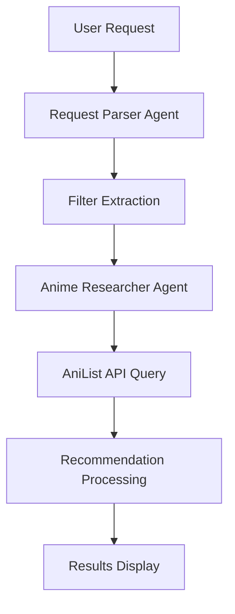

# 🌟 Osusume: Agentic-AI Anime Recommender System


## 📖 Overview

**Osusume** (おすすめ - "recommendation" in Japanese) is an advanced anime recommendation system that uses AI to understand your preferences in natural language. Simply describe what you feel like watching, and Osusume will suggest personalized anime recommendations by combining large language model (LLM) capabilities with the AniList database.

<div align="center">
  
```
"I want an isekai anime with some comedy" → 🤖 → [Personalized Recommendations]
```

</div>


## ✨ Features

- 🗣️ **Natural Language Understanding**: Express what you want in plain English
- 🧠 **AI-Powered Filtering**: Automatically extracts relevant genres, tags, and attributes
- 🔍 **Semantic Search**: Find anime similar to titles you already enjoy
- 🖼️ **Rich Visual Results**: View recommendations with images and descriptions
- 🚀 **Simple Web Interface**: Easy-to-use Gradio UI

## 🛠️ Architecture

Osusume uses a multi-agent AI system powered by the [CrewAI](https://github.com/crewai/crewai) framework. The architecture consists of:

### Core Components

1. **Request Parser** (`src/request_parser.py`)

   - Defines structured parameter schemas
   - Maintains official genre classifications

2. **Analyzer** (`src/analyzer.py`)

   - Leverages OpenAI's GPT-4.1 model
   - Extracts relevant tags and genres from anime titles

3. **AniList Query Searcher** (`src/anilist_query_searcher.py`)

   - Interfaces with AniList's GraphQL API
   - Performs structured queries with multiple filters

4. **Recommender** (`src/recommender.py`)

   - Implements the CrewAI tool for searching anime
   - Handles parameter validation and taste profile building

5. **Service Layer** (`service.py`)

   - Orchestrates the recommendation pipeline
   - Manages agent coordination and result formatting

6. **UI** (`ui/gradio_app.py`)
   - Provides a web interface using Gradio
   - Renders recommendation cards with images

## 🧩 How It Works

Osusume uses a sequential AI pipeline:



### 1. 🔍 Request Analysis

When you enter a request like "I want an isekai anime with some comedy":

- The **AniListRequestMapper** agent analyzes your text
- It identifies important filters (genres, tags, years, etc.)
- It maps descriptive phrases to official AniList genres and tags
- The result is a structured query parameter set like:
  ```json
  {
    "genres": ["Comedy"],
    "tags": ["Isekai"]
  }
  ```

### 2. 📊 Recommendation Generation

Using these structured parameters:

- The **Anime Researcher** agent queries the AniList database
- It finds anime matching the extracted criteria
- It ranks results by relevance and popularity
- For each result, it extracts titles, descriptions, and images
- It returns a formatted list of recommendations

### 3. 🖥️ Results Presentation

The Gradio UI presents results as visual cards showing:

- Anime title
- Brief description explaining why it matches your request
- Cover image from AniList

## 🧠 AI Techniques Explained

### Large Language Models (LLMs)

Osusume uses OpenAI's GPT-4.1 to:

1. **Understand natural language requests**: Converting free-text input into structured parameters
2. **Extract semantic meaning**: Identifying implied attributes not explicitly mentioned
3. **Generate personalized descriptions**: Creating human-readable justifications for recommendations

### Multi-Agent AI Systems

The CrewAI framework enables:

1. **Specialized agent roles**: Each agent has a specific responsibility in the pipeline
2. **Task decomposition**: Breaking complex problems into manageable sub-tasks
3. **Sequential processing**: Agents work in order, building on each other's outputs

### Parameter Extraction & Validation

The system implements:

1. **Pydantic schemas**: Ensuring data validation and type safety
2. **Genre/tag classification**: Distinguishing between official genres and descriptive tags
3. **JSON result formatting**: Standardizing outputs for consistent processing

### Profile Building

For requests mentioning existing anime:

1. **Taste profiles**: Extracting genres and tags from seed anime titles
2. **Preference aggregation**: Building a weighted taste profile
3. **Query expansion**: Using extracted preferences to find similar content

## 🚀 Getting Started

### Prerequisites

- Python 3.11+
- OpenAI API key (for GPT-4.1 access)

### Installation

1. Clone the repository:

   ```bash
   git clone https://github.com/yourusername/osusume.git
   cd osusume
   ```

2. Install dependencies:

   ```bash
   pip install -r requirements.txt
   ```

3. Set up your OpenAI API key:
   ```bash
   export OPENAI_API_KEY=your_api_key_here
   ```

### Running the UI

Launch the Gradio web interface:

```bash
python ui/gradio_app.py
```

The interface will be available at http://localhost:7860

## 📚 Usage Examples

Here are some example queries you can try:

- `I want an isekai anime with some comedy`
- `Give me something like Ghost in the Shell`
- `A dark fantasy from 2020`
- `A volleyball anime with good character development`
- `Something with time travel that isn't too complicated`

## 📊 Project Structure

```
/osusume
├── src
│   ├── analyzer.py           # GPT integration for tag/genre analysis
│   ├── anilist_query_searcher.py  # AniList API client
│   ├── recommender.py        # CrewAI tool implementation
│   └── request_parser.py     # Request parsing and validation
├── ui
│   └── gradio_app.py         # Gradio web interface
├── .gitignore
├── genres.json               # Official genre metadata
├── requirements.txt          # Project dependencies
├── sandbox.ipynb             # Development playground
├── service.py                # Recommendation service layer
└── tags.json                 # Tag metadata
```

## 👨‍💻 Development

The `sandbox.ipynb` notebook provides examples of how to interact with individual components for testing and development.

### Key Areas for Extension

1. **Additional Filters**: Expand the parameter set to include more specific filters
2. **UI Enhancements**: Add features like saving favorites or viewing detailed information
3. **Offline Mode**: Implement caching to reduce API calls
4. **User Profiles**: Add persistent user preferences
5. **More Data Sources**: Integrate with additional anime databases

## 📜 License

This project is licensed under the MIT License - see the LICENSE file for details.

## 🙏 Arigatou

- [CrewAI](https://www.crewai.com) for the multi-agent framework
- [AniList](https://anilist.co) for their comprehensive anime database and GraphQL API
- [Gradio](https://gradio.app) for the simple web UI framework
- [OpenAI](https://openai.com) for GPT-4.1

---
